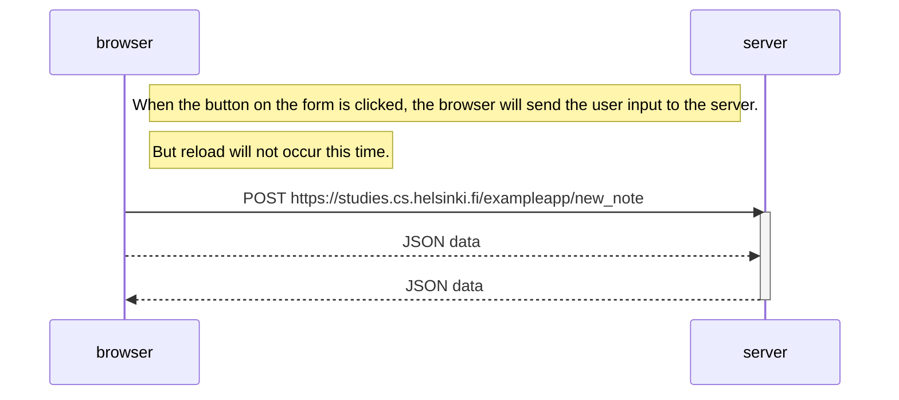

```mermaid
sequenceDiagram
    participant browser
    participant server
    
    Note right of browser: When the button on the form is clicked, the browser will send the user input to the server.
    Note right of browser: But reload will not occur this time.
    
    browser->>server: POST https://studies.cs.helsinki.fi/exampleapp/new_note
    activate server
    browser-->>server: JSON data
    server-->>browser: JSON data
    deactivate server
```
